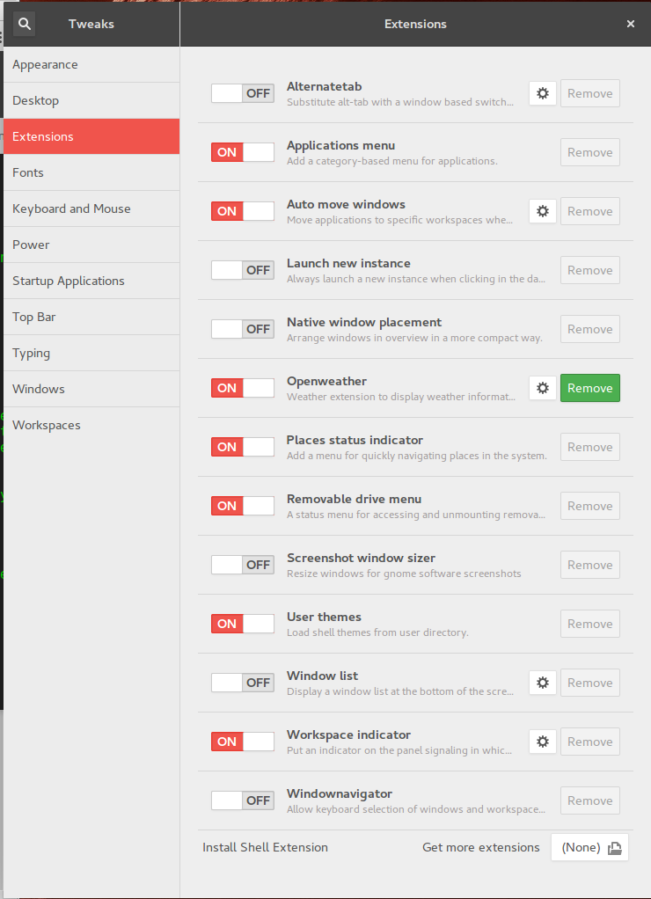

# Some configuration for my system

## Setting the Hyper Key
For some reason Ubuntu treats the *Hyper* key the same as the *Super* key, they are both assigned to `Mod3`.  Further complicating the issue Gnome doesn't source `.xinit` on startup so it's difficult to run `xmodmap`when a desktop session starts.  The best way I found is to modify the keyboard codes used in the X session by modifying the `xkb` configuration.  

**NOTE** Make a copy fo the file to be modified: 
```
sudo cp /usr/share/x11/xkb/symbols/pc /usr/share/x11/xkb/symbols/pc.ORIG
```

We are going to change the modifier of the *Super* key from `Mod3` to `Mod4`, this leaves the *Hyper* assigned to `Mod4` and the OS can disambiguate the 2 keys.

Open the file `/usr/share/x11/xkb/symbols/pc` and find all references to the `SUPER_L` and `SUPER_R` keys being assigned to `Mod4` and change it to `Mod3`:

Line 39: `modifier_map Mod4   { Super_L, Super_R };` -> `modifier_map Mod3   { Super_L, Super_R };`

Line 53: `modifier_map Mod4   { <SUPR> };` -> `modifier_map Mod3   { <SUPR> };` 

**NOTE** The drawback to this method is that if an update or program makes a change to the keyboard configuration file, changes are lost and need to be reapplied.  

## Keybindings
After the Hyper key has been mapped properly setup the shell level key-bindings by running
`dconf load /org/gnome/desktop/wm/keybindings/ < keybindings`

## Terminal
### User Profile
`dconf load /org/gnome/terminal/legacy/profiles:/:b1dcc9dd-5262-4d8d-a863-c897e6d979b9/ < terminal-profile`

### Keybindings
`dconf load /org/gnome/terminal/legacy/keybindings/ < terminal-keybindings`

## Gnome Tweaks
### Extensions


### Top Bar


### Typing


### Workspaces


## oh-my-zsh
### Install
+ `sudo apt-get install zsh`
+ `sh -c "$(curl -fsSL https://raw.githubusercontent.com/robbyrussell/oh-my-zsh/master/tools/install.sh)"`
+ logout & login

### Spaceship Theme
```
curl -o - https://raw.githubusercontent.com/denysdovhan/spaceship-zsh-theme/master/install.zsh | zsh
```

### Customizing the shell 

Copy files into `$ZSH_CUSTOM` (default `~/.oh-my-zsh/custom`) and they get sourced when the shell starts

+ **aliases.zsh** a file that contains command aliases
+ **path.zsh** adjusts `$PATH`

## Set up Python
1. Install pip: `sudo python get-pip.py`
1. Install virtualenv `sudo pip install virtualenv`


